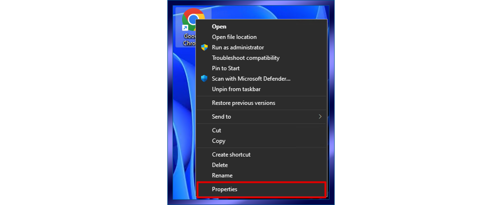
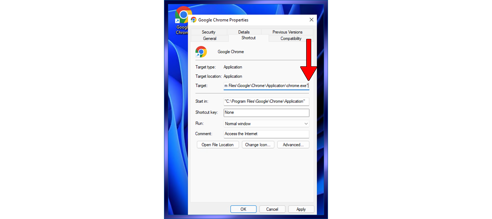
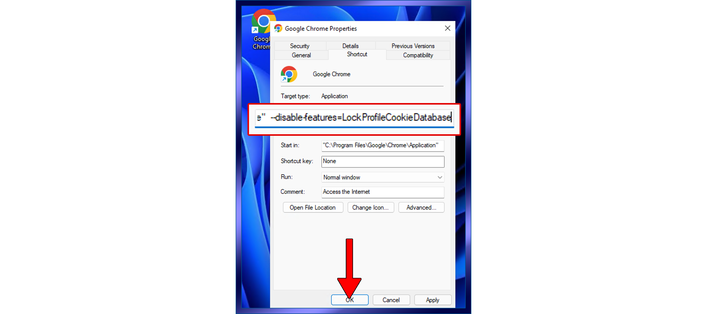

[]()

# Intro

iGet is a program that downloads Instagram Reels and Youtube videos.

### Usage

There are two basic ways to use the program. One is to add your video links into a que like this:

```bash
iget http://www.instagram.com/reel/link
iget http://www.youtube.com/video/link
```

Then, when you're ready to download them you type

```bash
iget get
```

The second option is to invoke the `watch` mode

```bash
iget watch
```

In watch mode, iGet monitors your clipboard and when it detects an Instagram reel link or a Youtube video link, it
downloads that link so then all you need to do while browsing Instagram in your browser is to copy the link to the
Instagram reel or Youtube video from the address bar of your browser. Move on to the next video and copy that link into
your clipboard. With each successive link you copy into your clipboard it gets added and downloaded automatically.

## Installation

Download the appropriate binary [from here](https://github.com/EasyG0ing1/iGet/releases/latest) and place it in a folder
that is in your PATH environment variable.


### Setup

The first time you run iGet, it will chose a default download folder for your videos and it will
give you the option to keep that folder or provide a new one. If the path that you type in does
not exist, you will have the option of creating it.

Next, it will ask you which browser you use to browse Instagram and Youtube. This is necessary
because there are times - especially with Instagram - when a reel or video cannot be downloaded
without logging into the service first. Specifying which browser you use will help the program
use the cookie that your browser has for authenticating to the service.

You will need to make sure that you are logged into the service in your browser when using iGet.

And that's it! Once it's setup, it's ready to use.

# Other Features

### Browser History

iGet can also look at your browsers History and you can add any of the links that you've browsed
into the que for downloading. This effectively lets you simply access those videos in your browser
then when you want to add everything you've browsed into the que you can do so by engaging the related options.

`browserHistory` will show you all of the Instagram and Youtube links that exist in your browsers history along with the
date and time that you accessed the link. The date and time are relevant because you can have iGet only import the links
that accessed within the last however many hours you specify. So lets that you were browsing for the last hour. You can
have iGet just add the links from your history from the last hour so that you don't have to import every single link in
your entire history.

`addBrowserHistory hours` - Use this option to tell iGet to import those links fom the last number of hours that you
specify and it will copy those links into the download que where you can downlod them using the `get` option.

All of the supported web browsers store history inside of a SQLite file, though not all file structires are the same. I
wrote the program to the specifications of each browser but I've only tested it with Chrome. If you have any problems
with this feature, please open an Issue so we can get it taken care of.

Also, iGet does not access your browsers history file directly. It first makes a backup copy of it and it works off of
the backup copy. It ensures that the backup copy is the most recent anytime you engage this feature.

### Cookies

The program that actually does the downloading of the videos is `yt-dlp` and it has the ability to access your browsers
cookies and use them to authenticate to the web server you are downloading from, just in case that server requires a
login before it will provide the content. This is most common with Instagram.

There are some situations where you need to do something in order for this to work correctly, which is discussed below
under Operating Systems.

It is important to note, that you must be actively logged into the site from your browser while you download content
from that site.

This feature is why it is important to use the setBrowser option. Because when you tell iGet which browser you use, then
iGet will tell `yt-dlp` which browser you use so that it knows how to access the cookies properly.

# Operating System Notes

## Linux

If you use Chrome in Linux, you might have problems downloading content that requires credentials. `yt-dlp` will attempt
to access your browsers cookies to use for web site authentication. However, Chrome in a Linux environment encrypts
cookies and keeps those encryption keys in a keychain file that is not always accessible.

If you experience download failures, try using Firefox instead of Chrome. Just make sure you're logged into the website
you're downloading from and make sure you set iGet to Firefox by using the `setBrowser` option.

Also, if you use the `watch` feature, you must start it from a terminal inside your GUI or else it won't work.

## Windows

If you use Chrome in Windows, you might experience problems where the program says that it cannot access your cookies.
This is because in Windows, Chrome puts a lock on the file while the browser is open. But there is an easy way to get
around this. You just need to change the shortcut that you use to launch Chrome.

First, right click on the shortcut and select Properties

[]()

Next, place the cursor just after the last quote mark in the Target field

[]()

Then hit the space bar and paste in this text:

```
--disable-features=LockProfileCookieDatabase
```

[]()

Then click OK.

Close then open your browser for the option to take effect.

### MacOS

No issues ... everything just works ;-)

Here is the rundown of the command line options:

* `iget http://link` just invoking iget followed by a URL puts that URL into the que
* `get` - Starts downloading everything that is in the que
* `get url` - If you put a URL after get, it downloads that URL immediately
* `watch` - Starts Watch mode where it monitors your clipboard for links
* `setFolder` - Set the download folder for your videos
* `setBrowser` - Set which browser you use (IMPORTANT!)
* `list` - Shows you all links in the que
* `cmds` - Shows you the actual command that will be executed when you use `get`
* `history` - Shows all links you have downloaded
* `reset` - resets the database and all settings to default as though you just installed the program from scratch (use
  with caution!)
* `clear` - Clears out the download history
* `remove` - gives you a list of links in the que so you can selectively frome any if desired
* `failed` - shows you all downloads that failed
* `version` - gives you the version of the program
* `browserHistory` - shows you all of the relevant links in your browsers history
* `checkBrowser` - Checks to see if it can access your browsers history file
* `setBrowserPath` - You can manually set the location of your browsers history file
* `addBrowserHistory hours` - Add the history from your browser into the que from the last number of hours that you
  specify
* `th` - Toggle History - iGet will reject new links that you supply it if it sees that you've already downloaded the
  link. This option toggles that behavior where when disabled, iGet will accept all links even if previously downloaded.

## Building Binaries

The binaries have already been built and are available [here](https://github.com/EasyG0ing1/iGet/releases/latest)

However, if you want to build the binary yourself, click [here](./build/environment.md)

This might be necessary if you are using Linux but you aren't running Ubuntu and the binary that I compiled doesn't work
right.

## Version History

* 2.0.0
    * Initial Release
