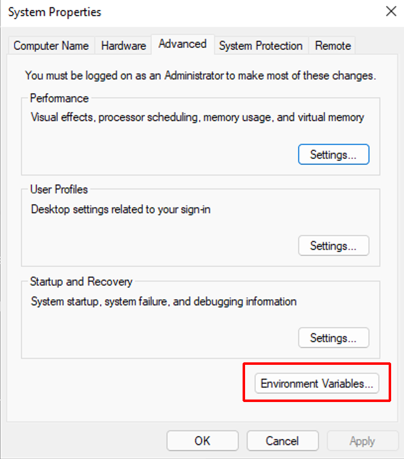
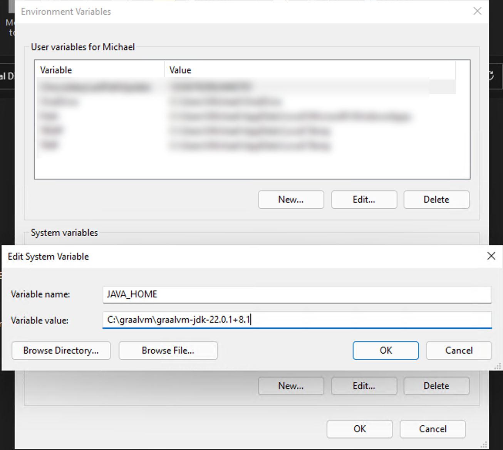
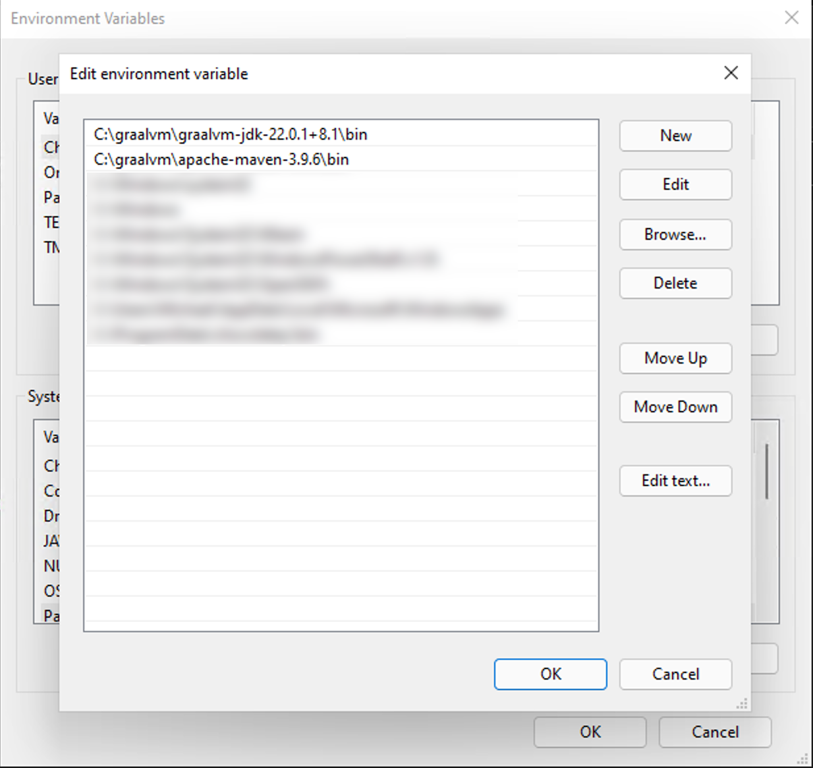
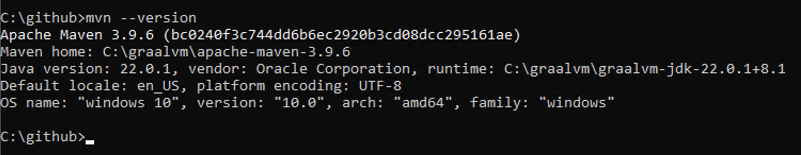

## Windows Build Environment

You will need GraalVM with Java version 22 and you can download it [here](https://www.graalvm.org/downloads/#)
Chose Java 22 and your Windows version then Download.

Create a folder off of the root of C and call it graalvm.

Next, extract the downloaded zip file into that folder. This should end up with a path that looks similar to
this: `C:\graalvm\graalvm-jdk-22.0.1+8.1`

Next, download Apache Maven from [here](https://maven.apache.org/download.cgi)

Get the Binary zip archive under Link.

Extract its contents to the C:\graalvm folder which will give you path similar to this: `C:\graalvm\apache-maven-3.9.6`

Next, you need to edit the environment variables so that the build tools know where to find Java and Maven.

Right click on This PC, Properties, and then click on Advanced system settings. Then click on the button that says
Environment
Variables

[]()

Next, you will need to create a new System environment variable named `JAVA_HOME`

[]()

The path needs to be the path that you extracted the graalvm zip file and it should look similar to whats in the picture
above.

Next, you need to edit the Path environment variable under System variables by double clicking it, then click New and
add a path to the `bin` folder of both GraalVM and Apache Maven and they should end up looking similar to this:

[]()

Click OK a couple of times to get out of those settings.

Next, we need to launch Chrome but only after you have edited the launch shortcut as described in the main README in
this project.

With Chrome open, go to instagram.com and pull up a reel video.

Now, open a CMD.EXE window. The easiest way to do that is to hold down the Windows key on your keyboard and then
press `R` then type in `cmd` and hit enter.

Next, create a github folder off the root

```bash
mkdir C:\github
cd C:\github
```

type: `mvn --version` and hit enter. You should see something that looks like this:

[]()

Go back to the [Main Instructions](./environment.md) and read from the section entitled **First**
