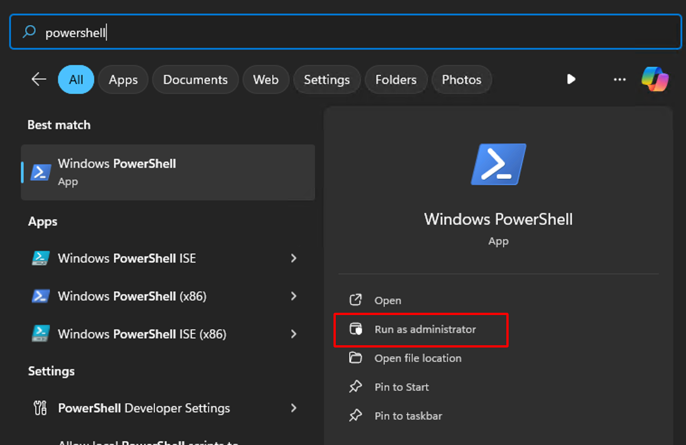

# Installing git for Windows

OK, you COULD just go to [this site](https://git-scm.com/download/win), download it and install it, but if you don't
have the `winget` tool installed on Windows, then you might consider this option:

Open a Powershell as administrator by tapping the Windows key on your keyboard, then just type in powershell and click
on the Run as Administarator oprion.

[]()
Once powershell is open, run this:

```bash
Add-AppxPackage -RegisterByFamilyName -MainPackage Microsoft.DesktopAppInstaller_8wekyb3d8bbwe
```

You can close powershell now.

But here's the thing ... I don't know why, but after you run that command, it takes some time for the `winget` program
to actually install, and you won't see anything indicating that it is installing or that it was installed ... you just
have to wait. In my case, I tried opening and re-opening a CMD shell and typoing `winget` to see if it was installed but
after several minutes, it wasn't so I just went and did other stuff for a while then came back and opened a `CMD` shell,
typed in `winget` and walla! There it was!

Once that is working, you can install `git` like this:

```bash
winget install --id Git.Git -e --source winget
```

That install you will see happening in real time. Once it's installed, you need to exit out of the cmd shell and open a
new one so that the changes it makes to the path are applied to the active shell.

[back to the instructions](./environment.md)
